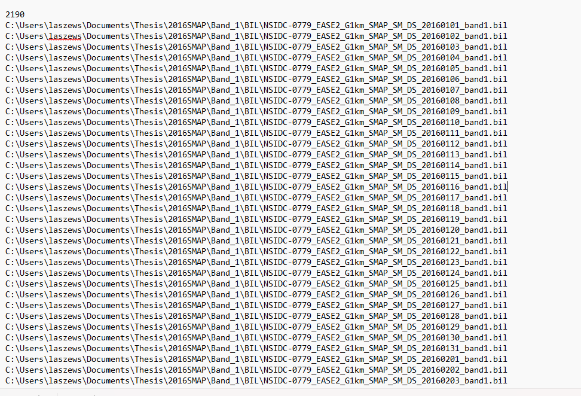
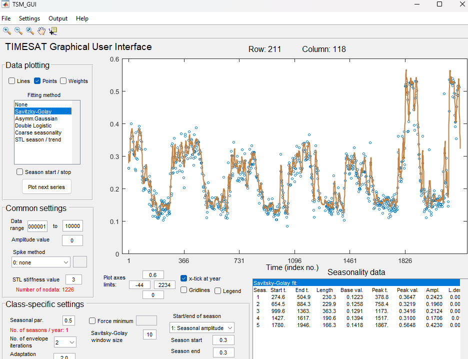

# Timesat-seasonality

access to data used
[SMAP SM](https://nsidc.org/data/nsidc-0779/versions/1)

## Part 1. Clipping and Conversions
### SMAP Soil Moisture(SM)
The image file contains data for the whole world, reducing the file size for analysis will be a more effective approach.

Original GeoTIFF file           |  Clipped GeoTIFF file
:-------------------------:|:-------------------------:
  |  

[Code for clipping to your extent](src-code/cliptif.py)

TIMESAT can only process specific file types, including BIL, not TIFF, so we will have to convert the images. 
Also, there are two bands, one for the ascending path of the L band radiometer and one for the descending path.
These bands will have to be separated during the BIL conversion. 

[Code for conversion to bil](src-code/TifToBILSMAP.py)

[More information on BIL files](https://desktop.arcgis.com/en/arcmap/latest/manage-data/raster-and-images/bil-bip-and-bsq-raster-files.htm)

### Vegetation Health (EVI)
The image file for EVI is in an h5 or Hierarchical Data Format (HDF), which indicates that multidimensional data is stored in the layer. 
This [page](https://lpdaac.usgs.gov/resources/e-learning/working-daily-nasa-viirs-surface-reflectance-data/) helped me work with the specific data I used.

original HDF file           |  Mosaic GeoTIFF file (and clipped GeoTIFF)
:-------------------------:|:-------------------------:
Has multiple layers and will not be accessible for analysis|  Not available for depection due to projection but combines the multiple images of EVI to create a mosaic of data covering the entire state of California plus extra data, but clipping extent defined by an inputted shapefile will remove the extra info.

This [code](src-code/h5toMosaic.py) essentially takes the HDF files covering an area of interest (x amount of files determined by files with the same date in the image name) and creates a TIFF image of the files in the same frame. Then, the mosaic is clipped to a more defined extent. 

The next step, similar to before, is to convert the TIFF to BIL using this [script](src-code/TIFtoBILEVI.py)

### Confirm handling of files
Confirm the conversion is successful by using [TIMESAT](https://web.nateko.lu.se/timesat/timesat.asp)

 *TSM_Imageviewer* allows you to look at your image.

Determine the number of rows and columns by looking at the header file of the bil file.
Then, for the image file type, look under n bits

## Part 2. Preprocessing in TSM_GUI

### Create text file of bil paths 

The image file paths need to be put into a text file in chronological order, which can be done using this [script](src-code/BILpaths.py) and an example of the text file below. (you will have to put number of file paths at the top yourself)

Open the TSM_GUI, set the number of years, and ensure the number of photos is shown. Also, fill in the other image information. 
The inputs changed from the automatic settings include: 
- Data range .00001 to 100000 (there are 0 values which are no data)
- No. of envelope interactions increased to 2 (Soil moisture and vegetation health are derived using remote sensing indices which typically underrepresent the ground values)
- Season starts at .3 of the amplitude to get a more significant portion of the season
- Savitzky-Golsay averaging window increased to 10 to reduce noise

An example of a pixel time series produced from the GUI is below:

Save this settings file to process all the images. 

## Part 3. Process Seasonality and Post-Processing

### TSF_process

Use TSF_process to run the seasonality model on all the pixels across however many years of data.

### Post-Processing 

An example of output image files for the length of the season will be given below, along with how to convert them so they can be analyzed in another software like QGIS or ArcGIS:

Use the TSF_fit2img to extract the length of season imagery for each season. The produced file is an ENVI headerless file that can only be read by TIMESAT.

This [code](src-code/CreateHDR.py) produces a header file based on the parameters of the image so the ENVI file can be converted into a TIFF using this [script](src-code/envitotif.py) and read by another software

