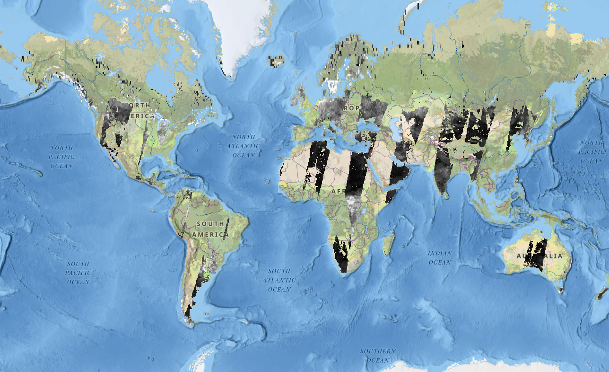
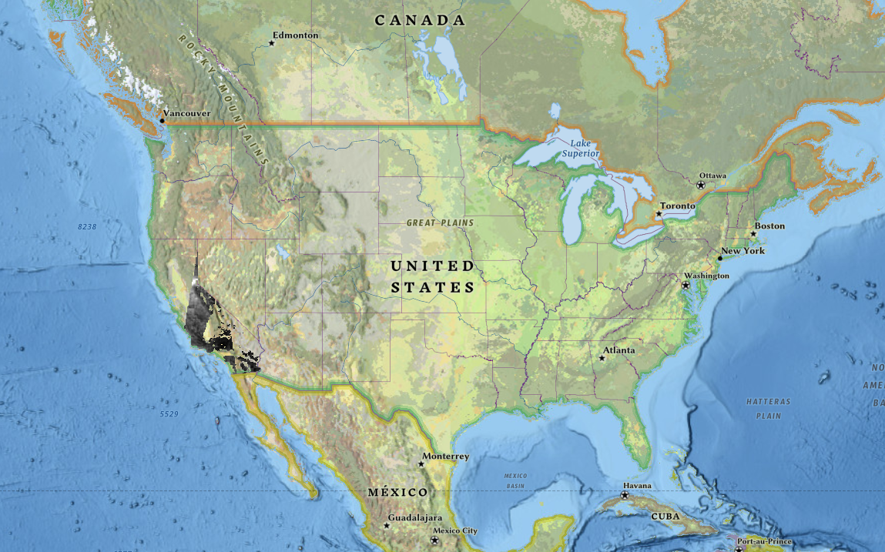
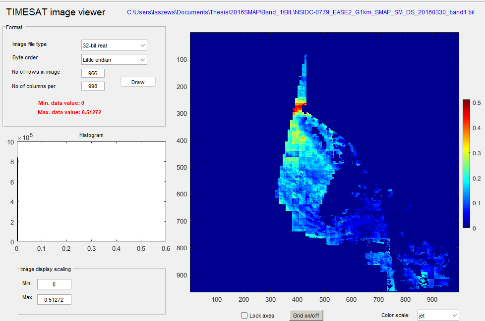

# Timesat-seasonality

access to data used
[SMAP SM](https://nsidc.org/data/nsidc-0779/versions/1)

## Part 1. Clipping and Conversions
### SMAP Soil Moisture(SM)
The image file contains data for the whole world, reducing the file size for analysis will be a more effective approach.

original GeoTIFF file           |  Clipped GeoTIFF file
:-------------------------:|:-------------------------:
  |  

[Code for clipping to your extent](src-code/cliptif.py)

TIMESAT can only process specific file types including BIL and not TIF, so we will have to convert the images. 
Also, there are two bands, one for the ascending path of the L band radiometer and one for the descending path.
These bands will have to be seperated during the BIL conversion. 

[Code for conversion to bil](src-code/TifToBILSMAP.py)

[More information on BIL files](https://desktop.arcgis.com/en/arcmap/latest/manage-data/raster-and-images/bil-bip-and-bsq-raster-files.htm)

### Vegetation Health (EVI)
The image file for EVI is in an h5 or Hierarchical Data Format (HDF) indicating there is multidimensional data stored in the layer. 
This [page](https://lpdaac.usgs.gov/resources/e-learning/working-daily-nasa-viirs-surface-reflectance-data/) helped me work with the specific data I used.

original HDF file           |  Mosaic GeoTIFF file (and clipped GeoTIFF)
:-------------------------:|:-------------------------:
Has multiple layers and will not be accessible for analysis|  Not available for depection due to projection but combines the multiple images of EVI to create a mosaic of data covering the entire state of California (and more but clipping extent defined by an inputted shapefile will remove the extra data)

This [code](src-code/h5toMosaic.py) essentially takes the HDF files covering area of interest and for each day (3 seperate files determined by date on image name), creates a TIFF image of the files in the same frame. Lastly, the mosaic is clipped to a more defined extent. 

Confirm the conversion is successful by using [TIMESAT](https://web.nateko.lu.se/timesat/timesat.asp)

 *TSM_Imageviewer* allows you to look at your image.

Determine the number of rows and columns by looking at the header file of the bil file.
Then, for the image file type look under n bits

