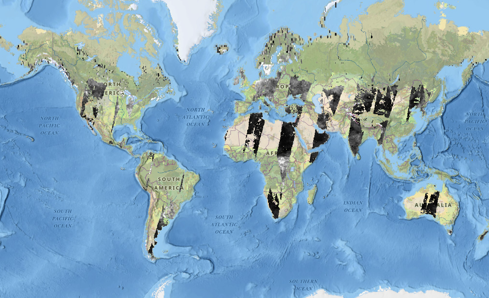
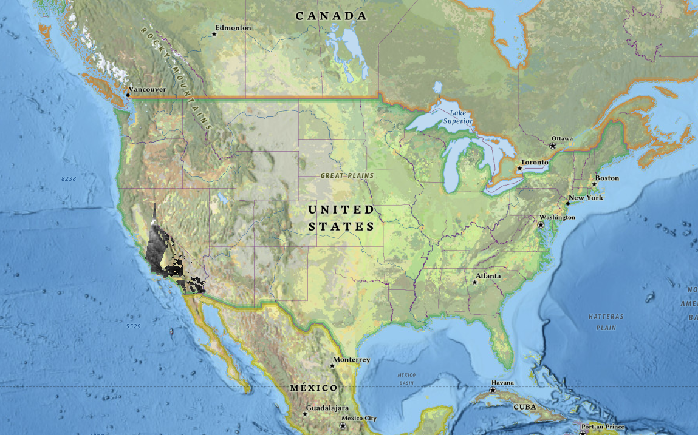
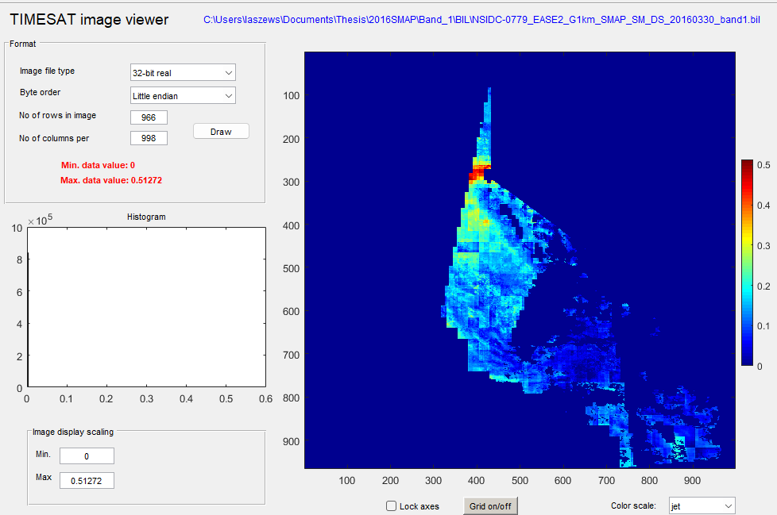
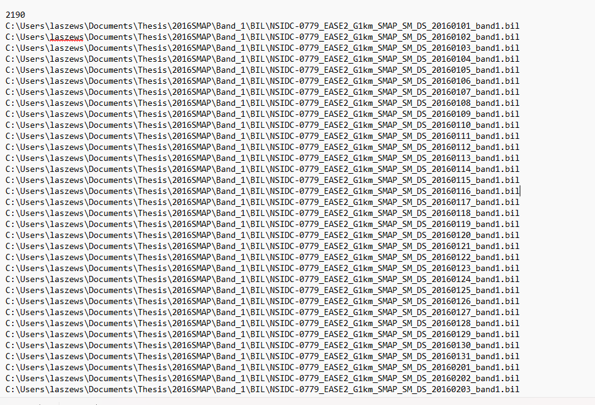
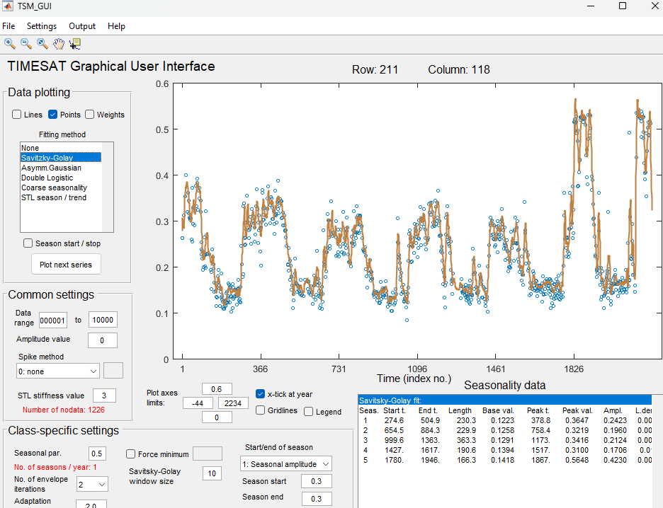
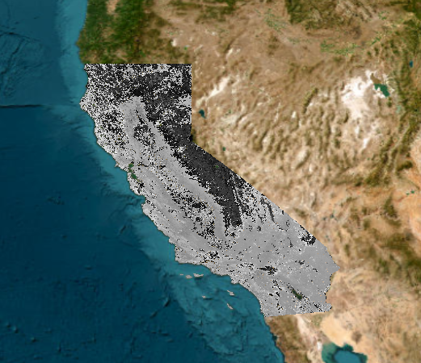

# TIMESAT-Seasonality Analysis Workflow

## 🔗 Data Sources
- **SMAP Soil Moisture (SM)**: [NSIDC - NSIDC-0779](https://nsidc.org/data/nsidc-0779/versions/1)
- **EVI (Enhanced Vegetation Index)**: [NASA VIIRS Data Guide](https://lpdaac.usgs.gov/resources/e-learning/working-daily-nasa-viirs-surface-reflectance-data/)

---

## 🧩 Part 1: Clipping and Conversion

### 1.1 SMAP Soil Moisture (SM)

**Original Data:**
- Global `.tif` file with two bands: ascending and descending paths of the L-band radiometer.

**Steps:**
1. **Clip the GeoTIFF to your study region**  
   - 📜 [Clipping script](src-code/cliptif.py)

   | Original | Clipped |
   |----------|---------|
   |  |  |

2. **Convert TIFF to BIL (Band Interleaved by Line)**  
   - Separate the bands during conversion  
   - 📜 [Conversion script](src-code/TifToBILSMAP.py)  
   - ℹ️ [What is BIL?](https://desktop.arcgis.com/en/arcmap/latest/manage-data/raster-and-images/bil-bip-and-bsq-raster-files.htm)

---

### 1.2 Vegetation Greenness (EVI)

**Original Data:**
- HDF5 format with multiple bands.

**Steps:**
1. **Mosaic and clip HDFs to GeoTIFF**
   - 📜 [Mosaicking and clipping script](src-code/h5toMosaic.py)

2. **Convert TIFF to BIL**
   - 📜 [Conversion script](src-code/TIFtoBILEVI.py)

---

### ✅ Confirm BIL Output in TIMESAT

- Use **TSM_Imageviewer** to inspect the `.bil` file.
- Check the `.hdr` file for:
  - `nrows`, `ncols`
  - `nbits`

📷 Example:


---

## 🛠️ Part 2: TIMESAT Preprocessing in GUI

### 2.1 Prepare Input File List

Create a `.txt` file with `.bil` file paths in **chronological order**.

- 📜 [File path script](src-code/BILpaths.py)
- Add the total number of file paths as the first line manually.

📷 Example:


---

### 2.2 Set TIMESAT Parameters

Open **TSM_GUI** and set:

- **Number of years** and **number of images**
- **Data range**: `0.00001` to `100000`
- **Envelope interactions**: `2`
- **Season start**: `0.3` of amplitude
- **Savitzky-Golay window**: `10`

📷 Example:


➡️ Save the settings file for processing.

---

## ⚙️ Part 3: Seasonality Processing & Post-processing

### 3.1 Run TIMESAT

Use `TSF_process` to run the model over the image stack.

---

### 3.2 Extract Seasonality Metrics

Use `TSF_fit2img` to extract metrics such as:
- Length of season for VG
- Middle of season for SM and VG
- small integer for SM
- large integer for SM

Files are ENVI binary with **no header**.

---

### 3.3 Create Header Files

- 📜 [Header creation script](src-code/CreateHDR.py)
- 📄 Example: [EVImiddle1_season1.hdr](images/EVImiddle1_season1.hdr)

Convert the binary to GeoTIFF:
- 📜 [ENVI to TIFF conversion script](src-code/envitotif.py)

📷 Output example:


---

### 3.4 Average Multiple Seasons

Calculate average seasonal metrics (e.g., average middle of season):

- 📜 [Averaging script](src-code/Averagetifsmiddle.py)

To compute **lag**:
```python
Lag = EVI_middle_of_season - SM_middle_of_season

📊 ## Part 4: Regression and Clustering

###4.1 Regression Analysis

- Bin pixels along the x-axis into groups of 300.
- Compute linear regressions between small int SM and lag of difference between VG-SM

Visualization:


