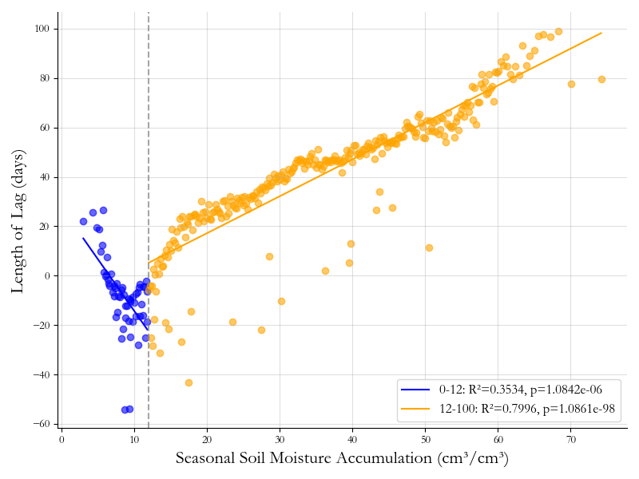
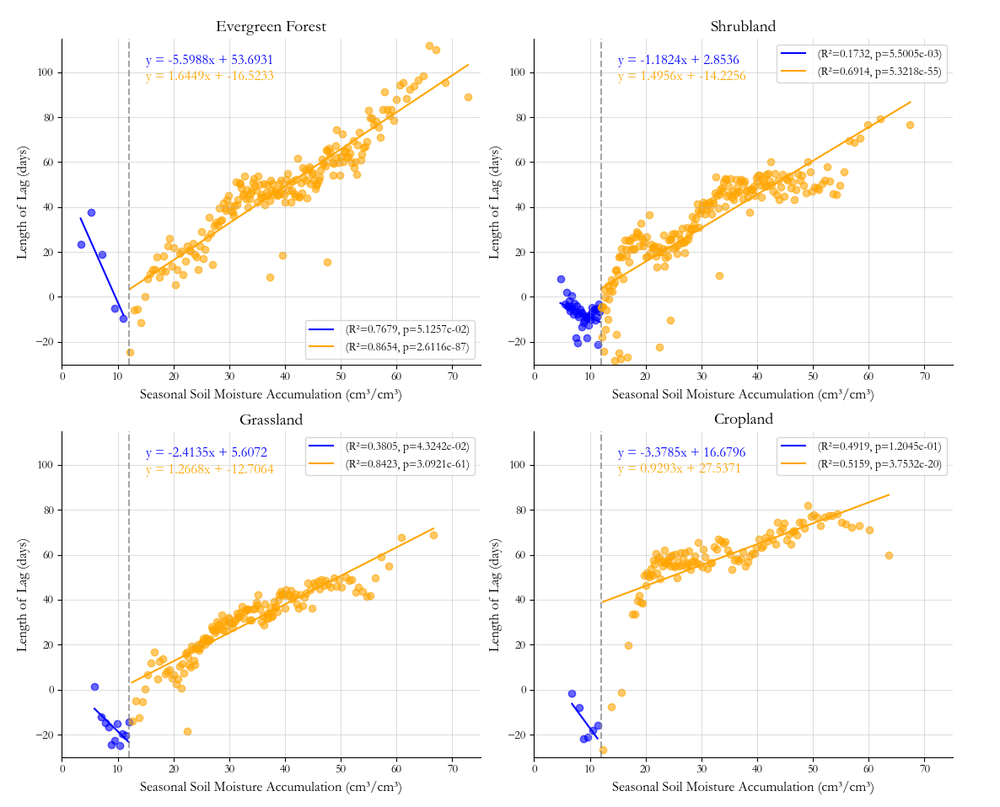
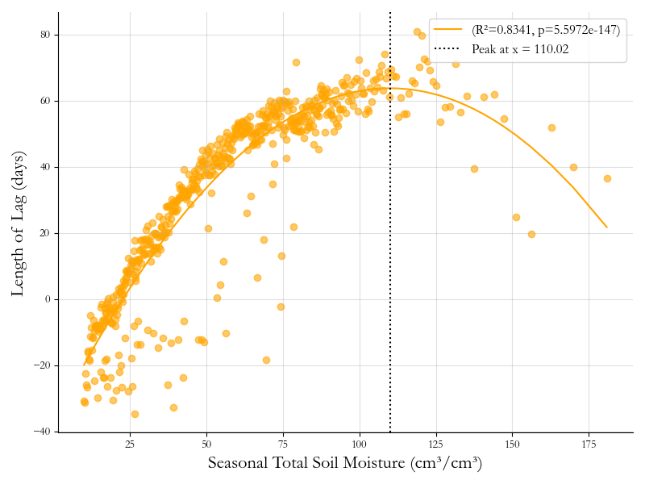
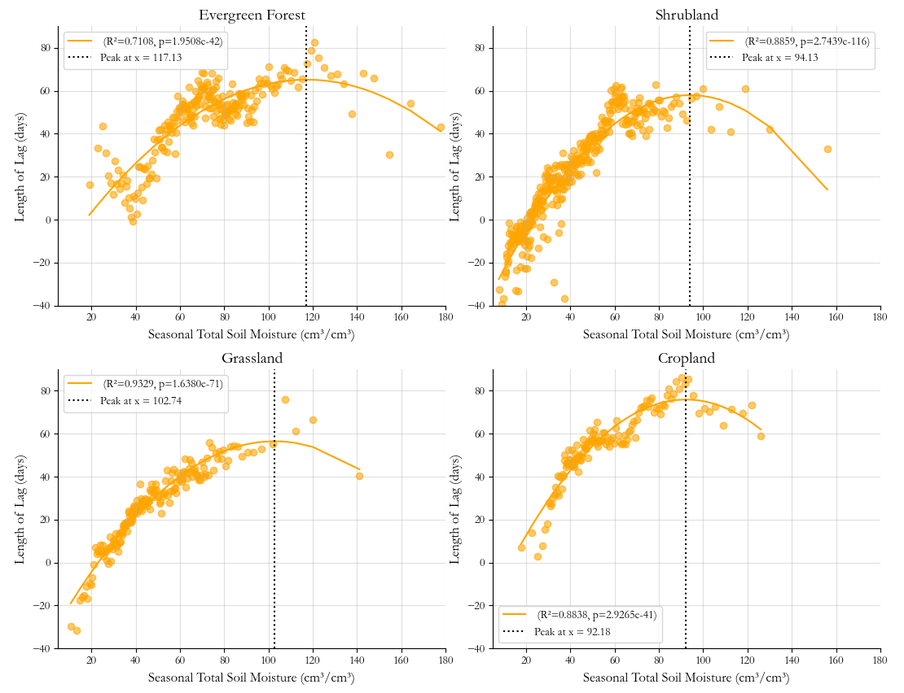
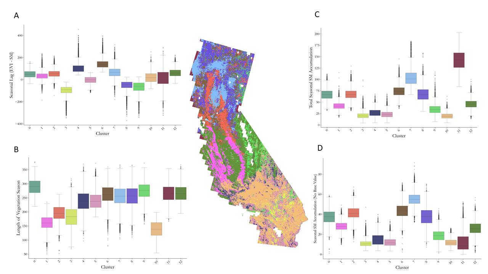

# TIMESAT-Seasonality Analysis Workflow

## 🔗 Data Sources
- **SMAP Soil Moisture (SM)**: [NSIDC - NSIDC-0779](https://nsidc.org/data/nsidc-0779/versions/1)
- **EVI (Enhanced Vegetation Index)**: [NASA VIIRS Data Guide](https://lpdaac.usgs.gov/resources/e-learning/working-daily-nasa-viirs-surface-reflectance-data/)

---

## 🧩 Part 1: Clipping and Conversion

### 1.1 SMAP Soil Moisture (SM)

**Original Data:**
- Global `.tif` file with two bands: ascending and descending paths of the L-band radiometer.

**Steps:**
1. **Clip the GeoTIFF to your study region**  
   - [Clipping script](src-code/cliptif.py)

   | Original | Clipped |
   |----------|---------|
   |  |  |

2. **Convert TIFF to BIL (Band Interleaved by Line)**  
   - Separate the bands during conversion  
   - [Conversion script](src-code/TifToBILSMAP.py)  
   - [What is BIL?](https://desktop.arcgis.com/en/arcmap/latest/manage-data/raster-and-images/bil-bip-and-bsq-raster-files.htm)

---

### 1.2 Vegetation Greenness (EVI)

**Original Data:**
- HDF5 format with multiple bands.

**Steps:**
1. **Mosaic and clip HDFs to GeoTIFF**
   - [Mosaicking and clipping script](src-code/h5toMosaic.py)

2. **Convert TIFF to BIL**
   - [Conversion script](src-code/TIFtoBILEVI.py)

---

### Confirm BIL Output in TIMESAT

- Use **TSM_Imageviewer** to inspect the `.bil` file.
- Check the `.hdr` file for:
  - `nrows`, `ncols`
  - `nbits`

📷 Example:

---

## 🛠️ Part 2: TIMESAT Preprocessing in GUI

### 2.1 Prepare Input File List

Create a `.txt` file with `.bil` file paths in **chronological order**.

- [File path script](src-code/BILpaths.py)
- Add the total number of file paths as the first line manually.

Example:

---

### 2.2 Set TIMESAT Parameters

Open **TSM_GUI** and set:

- **Number of years** and **number of images**
- **Data range**: `0.00001` to `100000`
- **Envelope interactions**: `2`
- **Season start**: `0.3` of amplitude
- **Savitzky-Golay window**: `10`

Example:

Save the settings file for processing.

---

## ⚙️ Part 3: Seasonality Processing & Post-processing

### 3.1 Run TIMESAT

Use `TSF_process` to run the model over the image stack.

---

### 3.2 Extract Seasonality Metrics

Use `TSF_fit2img` to extract metrics such as:
- Length of season for VG
- Middle of season for SM and VG
- small integer for SM
- large integer for SM

Files are ENVI binary with **no header**.

---

### 3.3 Create Header Files

- [Header creation script](src-code/CreateHDR.py)
- Example: [EVImiddle1_season1.hdr](images/EVImiddle1_season1.hdr)

Convert the binary to GeoTIFF:
- [ENVI to TIFF conversion script](src-code/envitotif.py)

Output example:

---

### 3.4 Average Multiple Seasons

Calculate average seasonal metrics (e.g., average middle of season):

- [Averaging script](src-code/Averagetifsmiddle.py)

compute **lag**:

Lag = EVI_middle_of_season - SM_middle_of_season

## Part 4: Regression and Clustering

### 4.1 Regression Analysis

This section explores the relationship between soil moisture (SM) and the lag between vegetation (VG) and SM phenology using both linear and quadratic regression models. Pixels are grouped in bins (300 pixels per group) to reduce noise and better visualize trends.

---

#### 4.1.1 Linear Regression (Small integer SM)

- Group pixels into bins of 300 along the x-axis.
- Perform linear regression between **seasonal accumulation SM** and the **lag** (VG - SM middle of season).

Script: [DynSmallInt.py](src-code/DynSmallInt.py)

 Example Output:  

**By Dominant Land Cover Types**  
- Linear regressions are also performed within dominant land cover classes.

Script: [panelsmallint.py](src-code/panelsmallint.py)

Example Output:  

---

#### 4.1.2 Quadratic Regression (Large Intensity SM)

- Group pixels into bins of 300 along the x-axis.
- Perform quadratic regression between **total SM** and the **lag** (VG - SM).

Script: [lrgintQuad.py](src-code/lrgintQuad.py)

Example Output:  

**By Dominant Land Cover Types**  
- Quadratic regressions within land cover types reveal how vegetation response varies with total SM.

Script: [lrgintpanels.py](src-code/lrgintpanels.py)

Example Output:  

---

### 4.2 K-Means Clustering

Unsupervised clustering identifies spatial patterns in the lag between SM and VG.

- Clustering is based on lag metrics, SM accummulation, and vegtation season length attributes.

Script: [Kmeans.py](src-code/Kmeans.py)

Cluster Map Output:  

---
